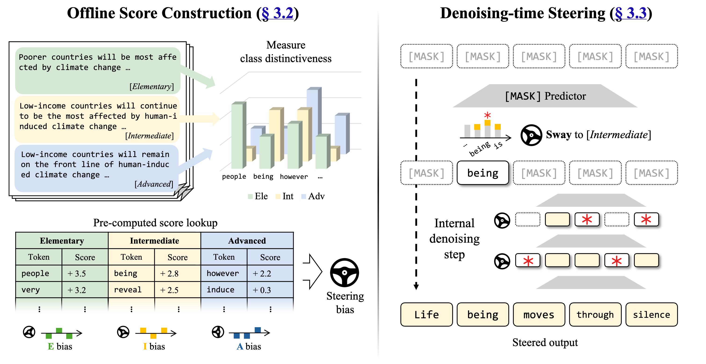
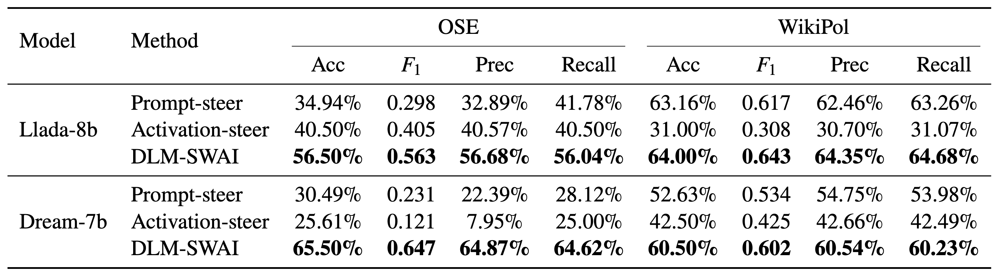

# DLM-SWAI

Official code for **DLM-SWAI**: a training-free, lookup-based logit-steering method for **Diffusion Language Models (DLMs)**.

Supports **LLaDA-8B-Instruct** and **Dream-v0-Instruct-7B** out of the box.

<p align="center">
  
</p>

---

## Overview

DLM-SWAI steers a DLM toward (or away from) a target attribute — *toxicity*, *political stance*, *persona*, etc. — by injecting a precomputed token-level score bias into the logits at **every denoising step** of block-wise diffusion sampling.

The pipeline is three steps:

1. **Build score table** — collect per-token attribute scores from labeled corpora.
2. **Steered generation** — bias the DLM's denoising distribution with the score table.
3. **Evaluation** — measure attribute control and generation quality.

No gradient updates. No fine-tuning. No extra forward passes. Just a vocabulary-sized bias vector added to logits.

---

## Why DLM-SWAI

- 🚫 **Training-free.** Works on any open DLM without parameter updates.
- ⚡ **Zero inference overhead.** A precomputed bias vector — no extra forward/backward passes.
- 🔌 **Plug-and-play.** Drop into LLaDA, Dream, or other masked-denoising LMs by swapping the tokenizer.
- 🔄 **Bidirectional control.** Reuses the same score table to *amplify* or *suppress* an attribute.
- 🌊 **Diffusion-native.** Designed for block-wise, multi-step denoising — control is applied at every step, not just once.

---

## Setup

```bash
pip install torch transformers tqdm
```

GPU with sufficient VRAM is required for 7–8B DLMs in fp16.

---

## Quick Start

End-to-end runs for each backbone:

```bash
bash run_llada.sh    # LLaDA-8B-Instruct
bash run_dream.sh    # Dream-v0-Instruct-7B
```

Each script runs Steps 1–3 across WikiPol, RealToxicity, and OSE.

---

## Pipeline

### 1. Build the score table

```bash
python build_scores.py \
    --dataset real_tox \
    --tokenizer GSAI-ML/LLaDA-8B-Instruct \
    --output_dir ./lookup_scores/llada8b/real_tox
```

### 2. Steered generation

```bash
python dlm_logit_steering.py \
    --dataset wikipol \
    --target I \
    --model_name GSAI-ML/LLaDA-8B-Instruct \
    --model_tag llada8b \
    --experiment rewriting \
    --steering_strength 0.7 \
    --block_length 32 \
    --max_new_tokens 32 \
    --num_samples 300
```

Key arguments:

| Argument | Description |
|---|---|
| `--dataset` | `wikipol`, `real_tox`, `ose` |
| `--target` | Attribute label (e.g. `T`/`NT` for toxic/non-toxic, `I`/`P`/`N` for WikiPol, `E`/`I`/`A` for OSE) |
| `--experiment` | `rewriting` or `open_ended` |
| `--steering_strength` (λ) | Bias multiplier (0 = off) |
| `--score_clip` (τ) | Per-token bias clamp |
| `--block_length` | Tokens per denoising block |

### 3. Evaluation

```bash
python eval_prepare.py --all --model_tag llada8b

# GPT-judge attribute scoring
export OPENAI_API_KEY="..."
python eval_gptjudge.py \
    --input eval_data/llada8b/eval_ose_open_ended.json \
    --prompt sys_prompts/ose_sys_prompt.txt

# Toxicity
python eval_perspective.py --api_key YOUR_KEY

# Quality (PPL, BERTScore, FKGL)
python eval_ppl_bertscore.py
python eval_fkgl.py
```

### Ablations

```bash
bash run_ablation.sh    # sweeps λ (steering strength), τ (score clip), α (Dirichlet prior)
```

---

## Repository Layout

```
DLM-SWAI/
├── build_scores.py          # Step 1: corpus → per-token score table
├── dlm_logit_steering.py    # Step 2: steered DLM generation
├── eval_*.py                # Step 3: evaluation suite
├── sys_prompts/             # GPT-judge prompts
├── run_llada.sh / run_dream.sh / run_ablation.sh
```

---

## Supported Datasets

| Dataset | Task | Targets |
|---|---|---|
| **WikiPol** | Paraphrase with political-stance control | I, P, N |
| **RealToxicity** | Detoxified paraphrasing | T, NT |
| **OSE** | Open-ended generation with persona control | E, I, A |

---

## Results

<p align="center">
  
</p>

---

## License

See [LICENSE](LICENSE).
